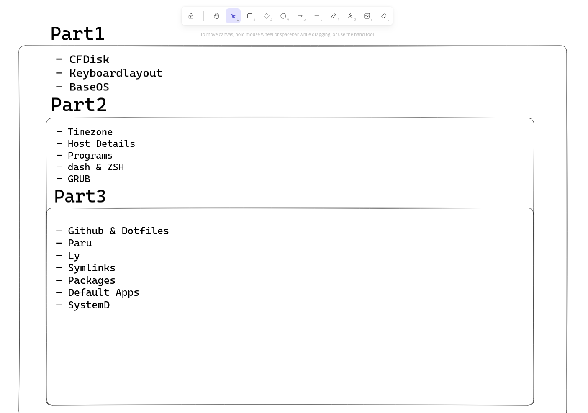

# Arch Install Script 🚀

## About 🌟

This Is Bash Script Which Automates The Setup OF My Linux Dev 

 
#### **Tools & methods Used**

- awk
- sed
- symlinking
- Arch linux system commands

#### **Features**

- retireves all my dotfiles and autoconfigures them in any new machine along with making a new **bare repo**

- configures custom repos and install all my software

-  Sets Up Multiple Desktop Environments like DE **Plasma,Hyprland** etc

- symlinks system congih files like etc/default/grub to user for easy configuration

## How It Works 🪨

This Script Majorly Has 3 Parts

**Part 1**

- sets the **keyboard layout**
- uses **CFdisk** to partion disks
- installs kernal and base OS
- uses **sed** to install second part of scripts in chroot environment(Physical Drive)

**Part 2**

- Sets Timezone And Host Details(IP,localhost etc.)
- Instals **GRUB** bootloader
- Installs common programs
- sets **dash** as /bin/sh
- sets **zsh** as default shell
- creates a new user

**Part 3**

- Gets all my **Dotfiles** from github and makes it a bare repo
- install **Paru** AUR helper
- Starts And customizes initial tty for **ly** display manager
- Creates symlinks
- installs all software from **pkglist.txt** along with two mini scripts to generate new packages
- Sets Default browsers,word processors and pdf viewers
- Starts additional Systemd Services

# Thats It, Thank You 🥳

